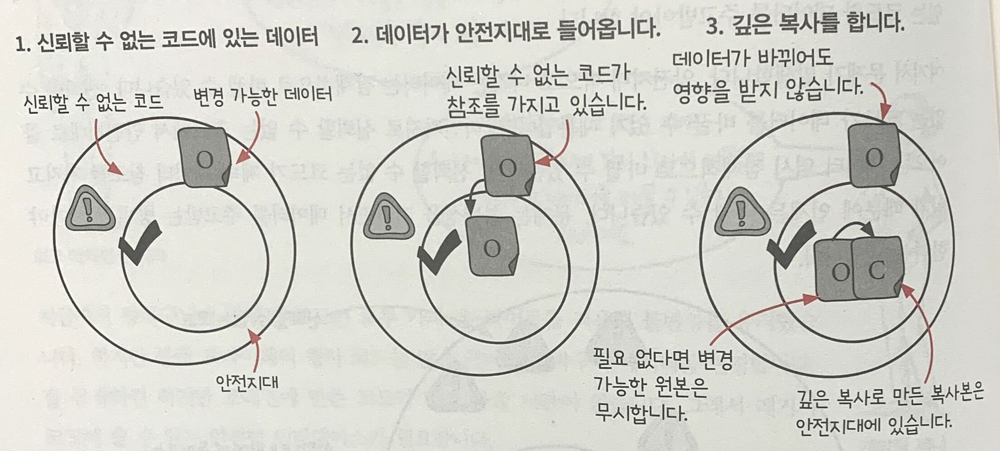
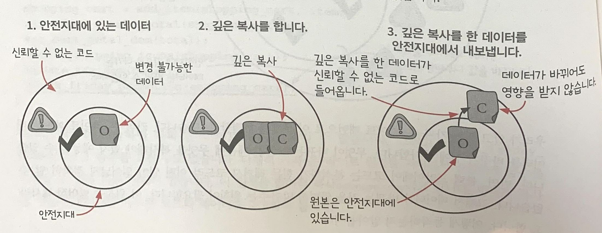

## Chapter 7 신뢰할 수 없는 코드를 쓰면서 불변성 지키기

지금까지는 카피-온-라이트 방식으로 데이터의 불변성을 유지해왔다. 라이브러리나 레거시 코드가 데이터를 변경한다면 카피-온-라이트 방식으로 데이터를 관리할 수 없다. 이런 경우, 어떻게 데이터의 불변성을 유지할 수 있을까?
<br/>

## 레거시 코드와 불변성

MegaMart에서 한달에 한 번씩 블랙 프라이데이 세일을 하기로 했다.

### 요구사항

🙋‍♂️ 고객이 장바구니에 제품을 담을 때 행사 가격이 적용되도록 할 수 있을까요?

지금까지 장바구니와 관련된 코드들은 카피-온-라이트를 적용하여 데이터들의 불변성을 유지했다. 그러나 블랙 프라이데이 행사 관련 코드는 오래 전에 만든 코드이면서 많은 곳에서 장바구니 데이터를 변경한다. 당장 고칠 시간도 있지 않아 이런 레거시 코드를 쓸 수 있는 안전한 인터페이스가 필요하다.

```jsx
function add_item_to_cart(name, price) {
  var item = make_cart_item(name, price);
  shopping_cart = add_item(shopping_cart, item);
  var total = calc_total(shopping_cart);
  set_cart_total_dom(total);
  update_shipping_icons(shopping_cart);
  update_tax_dom(total);
  // 블랙프라이데이 관련 코드, 하지만 이 코드는 장바구니 값을 바꾼다.
  black_friday_promotion(shopping_cart);
}
```

블랙프라이데이 함수를 추가하면 카피-온-라이트 원칙으로 쓰인 `add_item_to_cart `함수를 더 이상 카피-온-라이트 원칙으로 쓰였다고 말할 수 없게 된다.
그렇다고 `black_friday_promotion()` 함수도 고칠 수 없다.

<br/>

## 그럴때는 ! 카피-온-라이트 코드와 신뢰할 수 없는 코드 합치기

블랙 프라이데이 행사 함수는 카피-온-라이트를 적용하지 않았기 때문에 데이터의 불변성에 대해 신뢰할 수 없다.

카피-온-라이트를 적용한 코드들은 모두 불변성이 지켜져 걱정없이 쓸 수 있어 **안전지대**에 있다고 말할 수 있다.

블랙 프라이데이 행사 함수는 안전지대 밖에 있기 때문에 만약 이 블랙 프라이데이 함수를 그냥 사용한다면 이 함수의 입력과 출력을 통해 안전지대에 있는 코드와 데이터를 주고 받게 된다.
그러면 안전지대 밖으로 나가는 데이터가 바뀔 위험이 있고, 안전지대로 들어오는 데이터도 바뀔 위험이 있다. 그래서 카피-온-라이트 원칙을 지킬 수 없게 된다.

🙋‍♂️ **블랙 프라이데이 행사 함수도 카피-온-라이트하면 되는 거 아녀?**

카피-온-라이트 패턴은 무엇이 바뀌는 지 알기 때문에 데이터를 바꾸기 전에 무엇을 복사해야 할 지 예상할 수 있다. 하지만 블랙 프라이데이 행사 코드는 어떤 일이 일어날지 정확히 알 수 없는 레거시코드이기 때문에 카피-온-라이트 패턴을 적용할 수 없다.

그래서 **데이터가 바뀌는 것을 완벽히 막아줄 수 있는 방어적 복사** 원칙을 사용해야 한다.

<br/>

## 방어적 복사 사용하기

        키포인트 : 보관하려고 하는 데이터의 복사본을 만드는 것




바뀔 수도 있는 데이터가 신뢰할 수 없는 코드를 통해 안전지대로 들어오게 되면, **들어온 데이터로 깊은 복사본을 만들고 변경 가능한 원본은 버린다.**

반대로 안전지대에서 나가는 데이터도 신뢰할 수 없는 코드를 통해 변경될 수 있기 때문에 나가는 데이터도 깊은 복사본을 만들어 내보내야 한다.

한마디로 **들어오고 나가는 데이터의 복사본을 만드는 것이 방어적 복사가 동작하는 방식**이다.

- 규칙 1: 데이터가 안전한 코드에서 나갈 때 복사하기
- 규칙 2: 안전한 코드로 데이터가 들어올 때 복사하기

```jsx
function add_item_to_cart(name, price) {
  var item = make_cart_item(name, price);
  shopping_cart = add_item(shopping_cart, item);
  var total = calc_total(shopping_cart);
  set_cart_total_dom(total);
  update_shipping_icons(shopping_cart);
  update_tax_dom(total);
  // 데이터를 전달하기 전에 깊은 복사
  var cart_copy = deepCopy(shopping_cart);
  black_friday_promotion(shopping_cart);
  // 들어오는 데이터를 위해 깊은 복사
  shopping_cart = deepCopy(cart_copy);
}
```

## 방어적 복사와 관련된 코드 감싸기

```jsx
function add_item_to_cart(name, price) {
  var item = make_cart_item(name, price);
  shopping_cart = add_item(shopping_cart, item);
  var total = calc_total(shopping_cart);
  set_cart_total_dom(total);
  update_shipping_icons(shopping_cart);
  update_tax_dom(total);
  // 방어적 복사 함수 사용
  shopping_cart = black_friday_promotion_safe(shopping_cart);
}

// 방어적 복사와 관련된 코드
function black_friday_promotion_safe(cart) {
  var cart_copy = deepCopy(cart);
  black_friday_promotion(cart_copy);
  return deepCopy(cart_copy);
}
```

<br/>

## 카피-온-라이트와 방어적 복사 비교

### 언제 쓰지?

- 카피온라이트 : 통제할 수 있는 데이터를 바꿀 때 사용
- 방어적복사: 신뢰할 수 없는 코드와 데이터를 주고 받아야 할 때

### 어디서 쓰지?

- 카피온라이트 : 안전지대 어디서나 사용 가능 (데이터가 불변성을 가질 수 있도록 안전지대를 만들어줌)
- 방어적복사: 안전지대 경계에서 데이터가 오고 가는 곳에서

### 복사방식은?

- 카피온라이트 : 얕은 복사 사용
- 방어적복사: 깊은 복사 사용 (상대적으로 얕은 복사보다 비용 많이 든다)

### 규칙은?

- 카피온라이트

  1. 바꿀 데이터의 얕은 복사본 생성
  2. 복사본 변경
  3. 복사본 반환
     <br/>
     <br/>

- 방어적복사:

  1. 안전지대로 들어오는 데이터의 깊은 복사본 만들기
  2. 안전지대에서 나가는 데이터의 깊은 복사본 만들기

    <br/>

## 카피-온-라이트와 방어적 복사 중에 어떤 원칙이 더 중요할까?

데이터가 불변성을 가질 수 있는 안전지대를 만들기 위해서 카피-온-라이트 방식이 아닌 방어적 복사 방식을 사용할 수도 있지만, 깊은 복사는 중첩된 데이터 구조의 모든 것을 복사하기 때문에 바뀐 부분만 복사하는 얕은 복사, 카피-온-라이트에 비해 방어적 복사를 사용할 때 많은 비용이 든다.

상황에 따라 적절하게 두 원칙을 사용해야 한다. 방어적 복사만으로 코드를 작성할 수 없고 또 카피-온-라이트만으로도 코드를 작성할 수 없다.

둘은 서로에게 꼭 필요한 존재,,,

<br/>

---

### ❗️ 5줄 요약

- 방어적 복사는 불변성을 구현하는 원칙

- 방어적 복사는 깊은 복사를 한다. 그래서 많은 비용이 든다.

- 방어적 복사는 불변성 원칙을 구현하지 않는 코드로부터 데이터를 보호해준다.

- 방어적 복사는 신뢰할 수 없는 코드와 함께 사용할 때만 사용한다.

- 깊은 복사는 중첩된 데이터 전체를 복사하고 얕은 복사는 필요한 부분만 최소한으로 복사한다.

---
