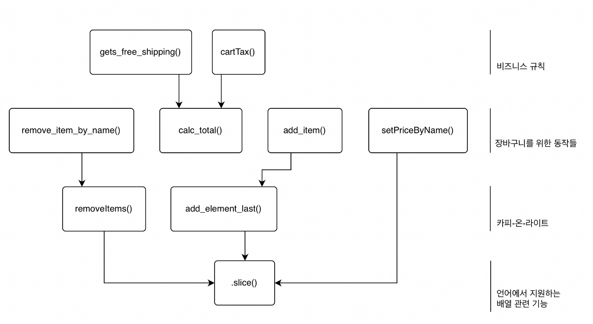
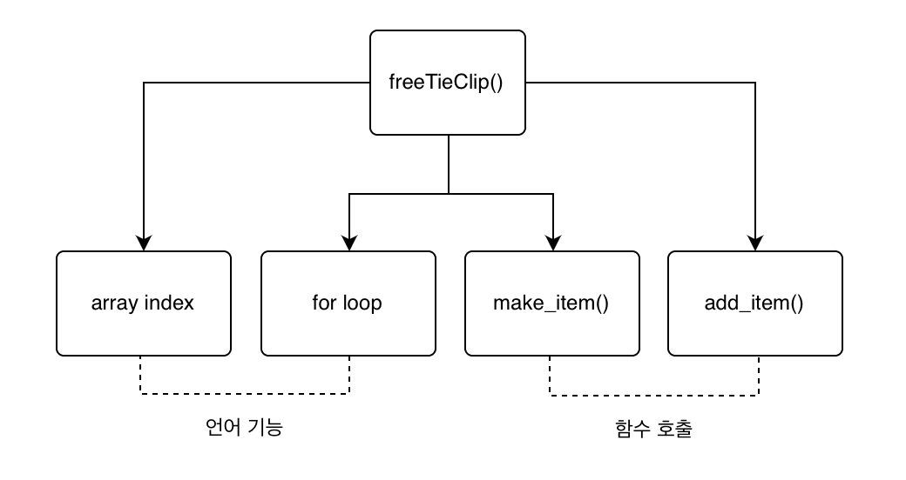
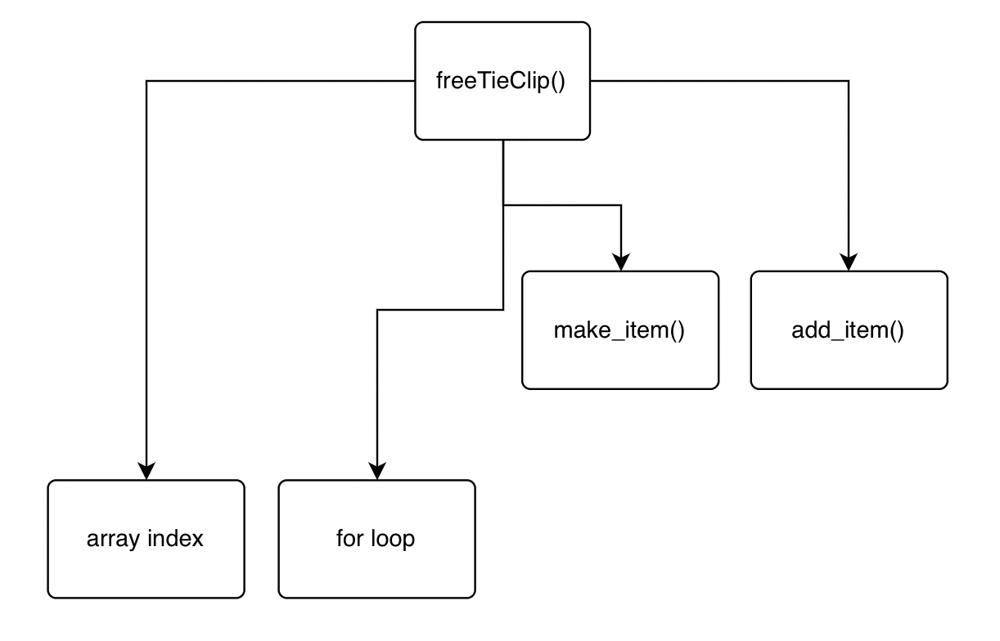
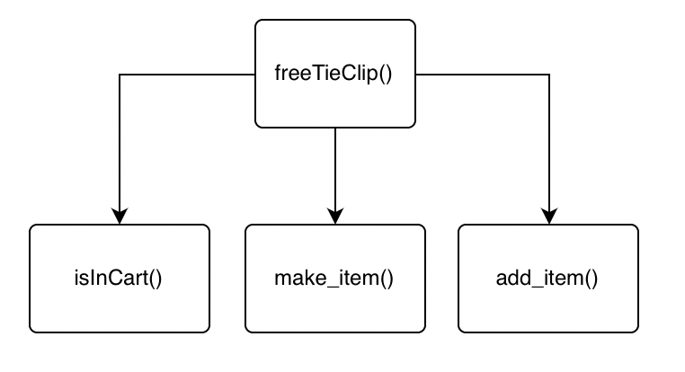
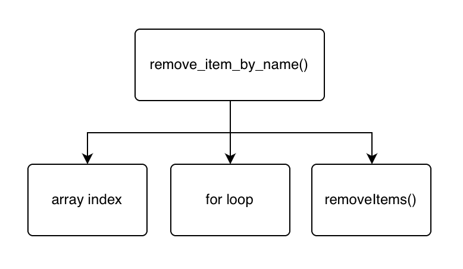

# Chapter 8 계층형 설계 (1)

## 소프트웨어 설계가 뭐야 ?

    설계를 잘하면 소프트웨어 개발 과정 전체에 도움이 된다. 아이디어를 코드로 구현하고 테스트하고 유지보수하기 쉽다.

## 소프트웨어 설계(software design)

    코드를 만들고, 테스트하고, 유지보수하기 쉬운 프로그래밍 방법을 선택하기 위해 미적 감각을 사용하는 것

## 계층형 설계란 ?

계층형 설계는 `소프트웨어를 계층으로 구성하는 기술`이다. 각 계층에 있는 함수는 바로 아래 계층에 있는 함수를 이용해 정의한다. 설계 감각을 키우면 소프트웨어를 고치고, 읽고, 테스트하고, 재사용하기 쉬운 코드를 만들기 위한 계층 구조가 무엇인지 알 수 있다. 계층(layer) 이 무엇인지 다음을 보면 알 수 있다.



**계층을 잘 구분하려면 ?** <br/>

    (1) 구분하기 위한 다양한 변수를 찾고
    (2) 찾은 것을 가지고 어떻게 해야 하는지 알아야 한다.
    👉🏻 좋은 설계를 위한 감각을 개발하고 그 감각을 따라가자!

## 설계 감각 키우기

### ☑️ 전문가의 저주

`본인의 전문 기술을 너무나도 잘 알지만 설명은 못하는`... 이것이 전문가의 저주다. <br/>
설명하는 것은 블랙박스와 같다.

전문가들이 블랙박스를 설명하지 못하는 이유는 복잡하기 때문이다. <br/>
블랙박스는 복잡하고 다양한 입력을 받아 복잡하고 다양한 결과물을 낸다.
<br/>
<br/>

### ☑️ 계층형 설계 감각을 키우기 위한 < 입력 >

계층형 설계 감각을 키우기 위해 다양한 입력을 생각해 볼 수 있다. 다음은 단서에 해당한다.

| **함수 본문**                 | **계층형 설계** | **함수 시그니처** |
| ----------------------------- | --------------- | ----------------- |
| - 길이                        | - 화살표 길이   | - 함수명          |
| - 복잡성                      | - 응집도        | - 인자 이름       |
| - 구체화 단계                 | - 구체화 단계   | - 인자값          |
| - 함수 호출                   | -               | - 리턴값          |
| - 프로그래밍 언어의 기능 사용 | -               | -                 |

<br/>

### ☑️ 계층형 감각을 키우기 위한 < 출력 >

여러 입력을 보면 머릿속에서 어떻게든 조합하게 된다. 어떤 사람들은 이러한 입력을 조합해 코드를 만드는 데 필요한 결정과 해야 할 일을 배운다. 계층형 설계 감각을 키우기 위한 입력으로 할 수 있는 일은 다양하다.

| 조직화                             | 구현                 | 변경                                 |
| ---------------------------------- | -------------------- | ------------------------------------ |
| - 새로운 함수를 어디에 놓을지 결정 | - 구현 바꾸기        | - 새 코드를 작성할 곳 선택하기       |
| - 함수를 다른 곳으로 이동          | - 함수 추출하기      | - 적절한 수준의 구체화 단계 결정하기 |
| -                                  | - 데이터 구조 바꾸기 | -                                    |

<br/>

## 계층형 설계 패턴

### 패턴 1 : 직접 구현

직접 구현은 계층형 설계 구조를 만드는 데 도움이 된다. 직접 구현된 함수를 읽을 때, 함수 시그니처가 나타내고 있는 문제를 함수 본문에서 적절한 구체화 수준에서 해결해야 한다. 만약 너무 구체적이라면 코드에서 나는 냄새이다.

### 패턴 2 : 추상화 벽

호출 그래프에 어떤 계층은 중요한 세부 구현을 감추고 인터페이스를 제공한다. 인터페이스를 사용하여 코드를 만들면 높은 차원으로 생각할 수 있다. 고수준의 추상화 단계만 생각하면 되기 때문에 두뇌 용량의 한계를 극복할 수 있다.

### 패턴 3 : 작은 인터페이스

시스템이 커질수록 비즈니스 개념을 나타내는 중요한 인터페이스는 작고 강력한 동작으로 구성하는 것이 좋다. 다른 동작도 직간접적으로 최소한의 인터페이스를 유지하면서 정의해야 한다.

### 패턴 4 : 편리한 계층

계층형 설계 패턴과 실천 방법은 개발자의 요구를 만족시키면서 비즈니스 문제를 잘 풀 수 있어야 한다. 소프트웨어를 더 빠르고 고품질로 제공하는 데 도움이 되는 계층에 시간을 투자해야 한다.

👉🏻 위 패턴은 너무 추상적이기 때문에 좀 더 구체적으로 알아보자!

## 패턴 1 : 직접 구현

구현된 코드를 어떻게 해야 잘 읽을 수 있는가 ? 계층 구조는 아무리 강력한 기능을 하는 함수가 있더라도 복잡하지 않게 함수를 표현해야 한다.

```jsx
function freeTieClip(cart) {
  var hasTie = false;
  var hasTieClip = false;

  for (var i = 0; i < cart.length; i++) {
    var item = cart[i];
    if (item.name === "tie") {
      // 넥타이가 있는지 확인
      hasTie = true;
    }
    if (item.name === "tie clip") {
      // 넥타이 클립이 있는지 확인
      hasTieClip = true;
    }
  }

  if (hasTie && !hasTieClip) {
    var tieClip = make_item("tie clip", 0);
    return add_item(cart, tieClip); // 넥타이 클립 추가
  }
  return cart;
}
```

어렵지 않은 코드다. 그렇지만 많은 기능이 있다. 장바구니를 돌면서 항목을 체크하고 무엇인가를 결정하고 있다. 이 코드는 제대로 설계하지 않고 그냥 기능을 추가한 것이다. 어떤 설계 원칙을 가지고 설계하지 않았다. 배열로 되어 있는 장바구니에서 넥타이 클립을 추가하면서 문제를 바로 해결했다. 이렇게 코드를 바로 추가하면 유지보수하기 어렵다.

이 코드는 첫 번째 계층형 설계 패턴인 직접 구현을 따르지 않고 있다. freeTieClip() 함수가 알아야 할 필요가 없는 구체적인 내용을 담고 있다. 마케팅 캠페인에 관련된 함수가 장바구니가 배열이라는 사실을 알아야 하는가 ? 장바구니 배열을 돌다가 오프-바이-원(off-by-one)\* 에러가 발생하면 실패하는가 ?

- `오프-바이-원(off-by-one)` : 주로 배열을 반복해서 처리할 때 '크다' 또는 '크거나 같다' 와 같은 비교문을 잘못 선택해 의도하지 않게 마지막 항목을 처리하지 못하거나 처리하는 오류를 말한다.

### 장바구니가 해야 할 동작

장바구니 설계를 개선하기 위해 설계 스프린트를 해보자. 코드에 있는 지식으로 장바구니가 해야 할 동작을 정리하자. 이 방법으로 코드가 어떻게 동작하는지 알 수 있다. 습관적으로 코드를 바로 작성하는 대신 해볼 수 있는 방법이다.

다음 목록은 장바구니에 필요한 동작과 구현이다.

### `제품 추가하기`

```jsx
function add_item(cart, item) {
  return add_element_last(cart, item);
}
```

### `제품 삭제하기`

```jsx
function remove_item_by_name(cart, name) {
  var idx = null;
  for (var i = 0; i < cart.length; i++) {
    if (cart[i].name === name) {
      idx = i;
    }
  }
  if (idx !== null) {
    return removeItems(cart, idx, 1);
  }
  return cart;
}
```

### 장바구니에 제품이 있는지 확인하기

### 합계 계산하기

```jsx
function calc_total(cart) {
  var total = 0;
  for (var i = 0; i < cart.length; i++) {
    var item = cart[i];
    total += item.price;
  }
  return total;
}
```

### 장바구니 비우기

### 제품 이름으로 가격 설정하기

```jsx
function setPriceByName(cart, name, price) {
  var cartCopy = cart.slice();
  for (var i = 0; i < cartCopy.length; i++) {
    if (cartCopy[i].name === name) {
      cartCopy[i] = setPrice(cartCopy[i], price);
    }
  }
  return cartCopy;
}
```

### 세금 계산하기

```jsx
function cartTax(cart) {
  return calc_tax(calc_total(cart));
}
```

### 무료 배송이 되는지 확인하기

```jsx
function gets_free_shipping(cart) {
  return calc_total(cart) >= 20;
}
```

**위에 구현되지 않은 두 가지를 구현해 보자.**

**제품이 있는지 확인하는 함수가 있다면 설계를 개선할 수 있다**

장바구니가 해야 할 동작을 모두 정리해보니 개선할 수 있는 부분을 발견했다. freeTieClip() 함수에 직접 구현 패턴을 적용할 수 있을 것 같다.

```jsx
function freeTieClip(cart) {
  var hasTie = false;
  var hasTieClip = false;

  for (var i = 0; i < cart.length; i++) {
    // 반복문은 장바구니에 넥타이와 넥타이 클립이 있는지 확인하고 있다
    var item = cart[i];
    if (item.name === "tie") {
      hasTie = true;
    }

    if (item.name === "tie clip") {
      hasTieClip = true;
    }
  }

  if (hasTie && !hasTieClip) {
    var tieClip = make_item("tie clip", 0);
    return add_item(cart, tieClip);
  }
  return cart;
}
```

장바구니 안에 제품이 있는지 확인하는 함수가 있다면, 저수준의 반복문을 직접 쓰지 않았을 것이다. 저수준의 코드는 추출해야 할 가능성이 높다. 반복문에서 다른 제품 두 개가 있는지 확인하고 있는데, 하나의 함수를 만들어 사용하도록 고치겠다.

- **개선전**

```jsx
function freeTieClip(cart) {
  var hasTie = false;
  var hasTieClip = false;
  for (var i = 0; i < cart.length; i++) {
    var item = cart[i];
    if (item.name === "tie") {
      hasTie = true;
    }
    if (item.name === "tie clip") {
      hasTieClip = true;
    }
  }
  if (hasTie && !hasTieClip) {
    var tieClip = make_item("tie clip", 0);
    return add_item(cart, tieClip);
  }
  return cart;
}
```

- **개선후**

```jsx
function freeTieClip(cart) {
  var hasTie = isInCart(cart, "tie"); // 수정
  var hasTieClip = isInCart(cart, "tie clip"); //수정

  if (hasTie && !hasTieClip) {
    var tieClip = make_item("tie clip", 0);
    return add_item(cart, tieClip);
  }
  return cart;
}

// 반복문 추춣해서 새로운 함수화
function isInCart(cart, name) {
  for (var i = 0; i < cart.length; i++) {
    if (cart[i].name === name) {
      return true;
    }
    return false;
  }
}
```

### 호출 그래프를 만들어 함수 호출을 시각화하기

`freeTieClip() `함수를 또 다른 관점으로 살펴보자. 함수에서 사용하는 다른 함수와 언어 기능을 호출 그래프(call graph) 로 그릴 수 있다. 반복문과 배열 인덱스를 참조하는 부분도 강조하기 위해 밑줄 표시를 했다. 그리고 호출 그래프로 그리겠다.

```jsx
function freeTieClip(cart) {
  var hasTie = false;
  var hasTieClip = false;
  for (var i = 0; i < cart.length; i++) {
    var item = cart[i];
    if (item.name === "tie") {
      hasTie = true;
    }
    if (item.name === "tie clip") {
      hasTieClip = true;
    }
  }
  if (hasTie && !hasTieClip) {
    var tieClip = make_item("tie clip", 0);
    return add_item(cart, tieClip);
  }
  return cart;
}
```



호출 그래프 아래쪽에 있는 상자는 모두 같은 추상화 수준인가 ? 아니다. make_item() 함수와 add_item() 함수는 직접 만든 함수다. 그리고 반복문이나 배열 인덱스 참조 기능은 언어에서 제공하는 기능이다. 직접 만든 함수와 언어 기능은 추상화 기준이 다르다. 반복문과 배열 인덱스를 참조하는 기능은 더 낮은 추상화 단계이다. 다이어그램으로 표현해 보겠다.



코드를 읽을 때 freeTieClip() 함수가 서로 다른 추상화 단계에 있다는 점을 다이어그램에서도 볼 수 있다. 화살표가 서로 다른 계층을 가리키고 있기 때문에 함수가 여러 계층을 사용하고 있다는 것을 알 수 있다. 한 함수에서 서로 다른 추상화 단계를 사용하면 코드가 명확하지 않아 읽기 어렵다.

개선된 freeTieClip() 함수를 그래프로 그려보면 어떨까 ?

### 직접 구현 패턴을 사용하면 비슷한 추상화 계층에 있는 함수를 호출한다

서로 다른 추상화 단계에 있는 기능을 사용하면 직접 구현 패턴이 아니다. 앞에서 개선하기 전 freeTieClip() 함수의 호출 그래프를 그려 살펴봤다. 코드를 봤을 때 느꼈던 것과 같은 것을 그래프로 그렸다.

```jsx
function freeTieClip(cart) {
  var hasTie = false;
  var hasTieClip = false;
  for (var i = 0; i < cart.length; i++) {
    var item = cart[i];
    if (item.name === "tie") {
      hasTie = true;
    }
    if (item.name === "tie clip") {
      hasTieClip = true;
    }
  }
  if (hasTie && !hasTieClip) {
    var tieClip = make_item("tie clip", 0);
    return add_item(cart, tieClip);
  }
  return cart;
}
```

다이어그램


이제 개선된 freeTieClip() 함수는 어떻게 될지 호출 그래프로 그려보자. 직접 구현에 가까울 것이라고 예상한다. 그리고 개선된 함수는 더 가까운 추상화 계층을 호출할 것이다.

```jsx
function freeTieClip(cart) {
  var hasTie = isInCart(cart, "tie");
  var hasTieClip = isInCart(cart, "tie clip");
  if (hasTie && !hasTieClip) {
    var tieClip = make_item("tie clip", 0);
    return add_item(cart, tieClip);
  }
  return cart;
}
```

다이어그램



freeTieClip() 에 있는 함수는 정확히 같은 추상화 단계인지 확실할 수 없지만 비슷한 추상화 단계를 사용하고 있는 것 같다. freeTieClip() 함수가 장바구니 기능을 사용하기 위해 알아야 할 것이 무엇인지 집중해 보자. freeTieClip() 은 장바구니가 배열로 되어 있는지 알아야 하는가 ?

freeTieClip() 이 사용하는 모든 함수는 장바구니가 배열인지 몰라도 된다. 장바구니가 배열인지 몰라도 된다는 것은 함수가 모두 비슷한 계층에 있다는 것을 의미한다. 이처럼 함수가 모두 비슷한 계층에 있다면 직접 구현했다고 할 수 있다.

### remove_item_by_name() 함수 그래프 그려보기

remove_item_by_name() 함수에 대한 호출 그래프를 그려보자.

```jsx
function remove_item_by_name(cart, name) {
  var idx = null;
  for (var i = 0; i < cart.length; i++) {
    if (cart[i].name === name) {
      idx = i;
    }
  }
  if (idx !== null) {
    return removeItems(cart, idx, 1);
  }
  return cart;
}
```

다이어그램



remove_item_by_name() 그래프를 freeTieClip() 함수 그래프 옆에 붙여 전체 그래프를 확장해보자. 다음 다이어그램에서 remove_item_by_name() 함수는 어느 계층에 붙어야 하는가 ? 다섯 계층 중 한 곳에 붙일 수 있다.


그중 add_item() 이 있는 위치를 예로 들 수 있는데, 이 위치에 오기 위해서 해당 위치에 있는 함수가 어떤 함수나 언어 기능을 호출하는지 보자. remove_item_by_name() 함수가 해당 위치에 있는 함수와 비슷한 점이 있다면 이 위치에 올 수 있는 확신을 가질 수 있다.

isInCart() 함수와 remove_item_by_name() 함수는 모두 같은 박스를 가리키고 있다. 같은 박스를 가리킨다는 것은 같은 계층에 있어도 좋다는 정보이다. 현재로서는 해당 위치에 놓는 것이 가장 좋아보인다.

**같은 계층에 있는 함수는 같은 목적을 가져야 합니다**

다이어그램은 명확하고 모호한 것이 없는 여섯 개의 계층으로 되어 있다. 함수를 어떤 계층에 놓을지 선택하는 과정은 복잡하다. 그래도 계층이 서로 구분되는 목적이 있따면, 함수가 위치할 계층을 선택하는 데 좋은 정보로 사용할 수 있다. 계층의 목적은 각 계층에 있는 함수의 목적과 같다.

(위와 같은 수순으로 계층을 나눌 수 있다. 가장 상단부터 순서대로 장바구니 비즈니스 규칙 > 일반적인 비즈니스 규칙 > 장바구니 기본 동작 > 제품에 대한 기본 동작 > 카피-온-라이트 동작 > 자바스크립트 언어 기능 으로 나눌 수 있다. - 그림 이후 추가,,)

각 계층은 추상화 수준이 다르다. 그래서 어떤 계층에 있는 함수를 읽거나 고칠 때 낮은 수준의 구체적인 내용은 신경 쓰지 않아도 된다.

다이어그램은 함수가 호출하는 것을 있는 그대로 표현한 것이기 때문에 함수를 어떤 계층에 놓을지 바로 알 수 있다. 그래서 다이어그램은 코드를 높은 차원에서 볼 수 있는 좋은 도구이다.

하지만 단순히 코드를 높은 차원에서 보기 위해 다이어그램을 이용하는 것은 아니다. 계층형 설계를 잘하기 위한 패턴을 살펴보고 있다는 것을 잊지 말자. 직접 구현은 계층형 설계를 하기 위한 방법 중 첫 번째 패턴이다. 직접 구현이 어떻게 계층형 설계에 도움이 될까 ? 다음을 통해 알 수 있다.

## 3 단계 줌 레벨

계층형 설계에서 문제는 세 가지 다른 영역에서 찾을 수 있다.

1. 계층 사이에 상호 관계
2. 특정 계층의 구현
3. 특정 함수의 구현

문제를 찾기 위해 알맞은 줌 레벨을 사용해 하나의 영역을 살펴볼 수 있다.

### 1. 전역 줌 레벨

    기본 줌 레벨이다. 계층 사이에 상호 관계를 포함해서 모든 문제 영역을 살펴볼 수 있다.

### 2. 계층 줌 레벨

    한 계층과 연결된 바로 아래 계층을 볼 수 있는 줌 레벨이다. 계층 줌 레벨로 계층이 어떻게 구현되어 있는지 알 수 있다.

### 3. 함수 줌 레벨

    함수 하나와 바로 아래 연결된 함수들을 볼 수 있다. 함수 줌 레벨로 함수 구현의 문제를 찾을 수 있다.

### 계층 줌 레벨로 보면 함수가 가리키는 화살표를 계층 간에 비교할 수 있다.

    다이어그램이 복잡해진다. 코드가 정돈되어 있지 않기 때문이다.
    직접 구현 패턴을 사용하면 모든 화살표가 같은 길이를 가져야 한다. 다양한 계층을 넘나드는 것은 같은 구체화 수준이 아니라는 뜻이다.

### 함수 줌 레벨을 사용하면 함수 하나가 가진 화살표를 비교할 수 있다.

    직접 구현 패턴을 적용하면 모두 같은 길이의 화살표를 가져야 한다. 어떻게 하면 화살표를 같은 길이로 만들 수 있는가 ?
    가장 일반적인 방법은 중간에 함수를 두는 것이다. 언어 기능을 사용하는 긴 화살표를 줄여야 한다.

<br/>

## 직접 구현 패턴 리뷰

### 💚 직접 구현한 코드는 한 단계의 구체화 수준에 관한 문제만 해결한다

        좋은 설계를 고민하지 않고 만든 코드는 읽거나 고치기 어렵다. 왜 어려운가 ? 코드가 서로 다른 구체화 단계에 있으면 읽기 어렵다. 코드를 읽을 때 이해해야 할 것이 많은데 구체화 단계가 다르다면 이해하기가 더 어렵다. 직접 구현하면 코드를 위해 알아야 하는 구체화 단계의 범위를 줄일 수 있다.

### 💚 계층형 설계는 특정 구체화 단계에 집중할 수 있게 도와준다

        코드에는 설계를 개선하기 위한 단서가 많이 있다. 하지만 큰 그림으로 한 번에 보기에는 너무 많은 정보가 있다. 호출 그래프는 함수가 서로 어떻게 연결되어 있는지 보여준다. 함수 시그니처와 본문, 호출 그래프와 같은 다양한 단서를 가지고 직접 코드 패턴을 적용할 수 있다.

### 💚 호출 그래프는 구체화 단계에 대한 풍부한 단서를 보여준다

        코드에는 설계를 개선하기 위한 단서가 많이 있다. 하지만 큰 그림으로 한 번에 보기에는 너무 많은 정보가 있다. 호출 그래프는 함수가 서로 어떻게 연결되어 있는지 보여준다. 함수 시그니처와 본문, 호출 그래프와 같은 다양한 단서를 가지고 직접 코드 패턴을 적용할 수 있다.

### 💚 함수를 추출하면 더 일반적인 함수로 만들 수 있다

        함수에 직접 구현 패턴을 적용하는 방법의 하나는 함수가 더 구체적인 내용을 다루지 않도록 함수를 일반적인 함수로 빼내는 것이다. 일반적인 함수는 보통 구체적인 내용을 하나만 다루기 때문에 테스트하기 쉽다. 명확한 코드와 알맞은 이름을 가진 함수는 더 읽기 쉽다.

### 💚 일반적인 함수가 많을수록 재사용하기 좋다

        함수로 빼내면 재사용할 수 있는 곳이 보인다. '중복 코드' 를 찾기 위해 함수를 빼내는 것과는 다르다. 구현을 명확하게 하기 위해 일반적인 함수를 빼내는 것이다. 일반적인 함수는 구체적인 함수보다 더 많은 곳에 쓸 수 있다. 그리고 사용할 곳을 따로 찾지 않아도 재사용할 수 있는 곳을 발견할 수 있을 것이다.

### 💚 복잡성을 감추지 않는다

        직접 구현 패턴을 적용한 코드처럼 보이게 만드는 것은 쉽다. 명확하지 않은 코드를 감추기 위해 '도우미 함수(helper function)' 를 만들면 된다. 하지만 이렇게 하는 것은 계층형 설계가 아니다. 계층형 설계에서 모든 계층은 바로 아래 계층에 의존해야 한다. 복잡한 코드를 같은 계층으로 옮기면 안된다. 더 낮은 구체화 수준을 가진 일반적인 함수를 만들어 소프트웨어에 직접 구현 패턴을 적용해야 한다.

### 챕터 8에서 중점적으로 볼 내용은 ?

- 소프트웨어 설계에 대한 실용적인 정의 소개

- 계층형 설계를 이해하고 어떤 도움이 되는지 알아보기

- 깨끗한 코드를 만들기 위해 함수를 추출하는 방법 배우기

- 계층을 나누어 소프트웨어를 설계하면 왜 더 나은 생각을 할 수 있는지 알아보기
