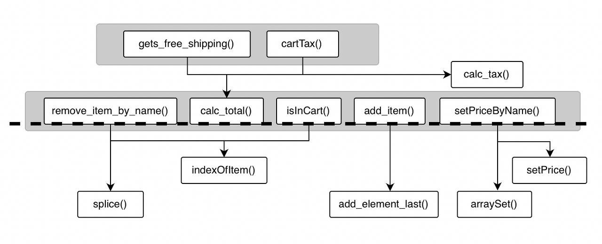

# Chapter 8 계층형 설계 (2)

챕터 9에서 중점적으로 볼 내용은 ?

- 코드를 모듈화하기 위해 추상화 벽을 만들기
- 좋은 인터페이스가 어떤 것이고, 어떻게 찾는지 알아보기
- 왜 계층형 설계가 유지보수와 테스트, 재사용에 도움이 되는지 이해하기

## 계층형 설계 패턴

### 패턴 2 : 추상화 벽

추상화 벽(abstraction barrier) 이라 하는 두 번째 패턴은 여러 가지 문제를 해결한다. 그중 하나는 팀 간 책임을 명확히 나누는 것이다.

### 추상화 벽으로 구현을 감춘다

추상화 벽(abstraction barrier) 은 세부 구현을 감춘 함수로 이루어진 계층이다. 추상화 벽에 있는 함수를 사용할 때는 구현을 전혀 몰라도 함수를 쓸 수 있다.

점선 위에 있는 함수로 마케팅 팀은 독립적으로 일할 수 있습니다. 점선 위에 있는 함수는 장바구니 데이터 구조에 대한 추상화 벽을 나타낸다. 추상화 벽은 데이터 구조를 몰라도 함수를 사용할 수 있다는 것을 의미한다.

점선 아래에 있는 함수로 개발팀은 독립적으로 일할 수 있다. 추상화 벽 아래서 일하는 사람들은 추상화 벽에 있는 함수를 어떻게 쓰는지 신경 쓰지 않고 일할 수 있다.

함수형 프로그래머는 문제를 높은 수준으로 생각하기 위해 추상화 벽을 효과적인 도구로 사용한다. 예를 들어 마케팅 팀은 지저분한 반복문이나 배열을 직접 다루지 않고 마케팅 코드를 만들기 위해 추상화 벽에 있는 함수를 사용할 수 있다.

## 세부적인 것을 감추는 것은 대칭적이다

추상화 벽을 사용하면 마케팅 팀이 세부 구현을 신경 쓰지 않아도 된다. 신경 쓰지 않아도 된다는 것은 대칭적이다. 추상화 벽을 만든 개발 팀은 추상화 벽에 있는 함수를 사용하는 마케팅 관련 코드를 신경 쓰지 않아도 된다. 두 팀 모두 독립적으로 일할 수 있다.

추상화 벽은 흔하게 사용하는 라이브러리나 API 와 비슷하다는 것을 느꼈을 것이다. 날씨 애플리케이션을 만들기 위해 RainCo 라는 회사에서 제공하는 기상 데이터 API 를 사용한다고 생각해 보자. RainCo 개발팀은 기상 데이터 서비스를 구현하는 역할을 한다. RainCo 개발팀은 당신이 만드는 날씨 애플리케이션에 신경 쓰지 않는다. 기상 데이터 API 는 책임을 명확히 나눠주는 추상화 벽과 같다고 할 수 있다.

개발팀은 추상화 벽의 한계를 시험하기 위해 장바구니 데이터 구조를 변경하려고 한다. 추상화 벽이 잘 동작한다면 마케팅 팀 코드를 바꾸지 않아도 되기 때문에 알려줄 필요가 없다.

## 장바구니 데이터 구조 바꾸기

현재 장바구니 데이터 구조는 배열로 이루어져 있다. 해당 로직은 비효율적이다. 조금 더 빠르게 찾을 수 있는 데이터 구조는 어떤 것인가 ? 해시 맵을 사용하는 것이 확실한 방법인 것 같다. 자바스크립트에서는 객체를 쓰면 된다.

function remove_item_by_name(cart, name) {

var idx = indexOfItem(cart, name);

if (idx !== null) {

      return splice(cart, idx, 1);

}

return cart;

}

function indexOfItem(cart, name) {

for (var i = 0; i < cart.length; i++) { // 배열을 순서대로 검색하는 것보다 해시 맵에서 찾는 것이 빠르다

      if (cart[i].name === name) {

         return i;

      }

}

return null;

}

오래전 문제가 하나 생각이 났다. 배열을 순서대로 검색하는 것은 성능이 떨어져서 해결해야 한다. 성능 문제는 깔끔한 인터페이스로 감춰지지 않는다.

배열 대신 자바스크립트 객체를 해시 맵처럼 쓰는 것이 확실한 방법이다. 객체에서 항목을 추가하거나 삭제하거나 항목이 있는지 확인하는 동작 모두 빠르다.

장바구니를 객체로 다시 만들기
장바구니를 자바스크립트 객체로 다시 만들어 보자. 자바스크립트 객체로 만들면 더 효율적이고 첫 번째 패턴인 직접 구현 패턴에 더 가깝다. 배열보다 객체가 어떤 위치에 추가하거나 삭제하기 좋다.

배열로 만든 장바구니

function add_item(cart, item) {
return add_element_last(cart, item);
}

function calc_total(cart) {
var total = 0;

for (var i = 0; i < cart.length; i++) {
var item = cart[i];
total += item.price;
}
return total;
}

function setPriceByName(cart, name, price) {
var cartCopy = cart.slice();
for (var i = 0; i < cartCopy.length; i++) {
if (cartCopy[i].name === name) {
cartCopy[i] = setPrice(cartCopy[i], price);
}
}
return cartCopy;
}

function remove_item_by_name(cart, name) {
var idx = indexOfItem(cart, name);
if (idx !== null) {
return splice(cart, idx, 1);
}
return cart;
}

function indexOfItem(cart, name) {
for (var i = 0; i < cart.length; i++) {
if (cart[i].name === name) {
return i;
}
}
return null;
}

function isInCart(cart, name) {
return indexOfItem(cart, name) !== null;
} 객체로 만든 장바구니

function add_item(cart, item) {
return objectSet(cart, item.name, item);
}

function calc_total(cart) {
var total = 0;
var names = Object.keys(cart);
for (var i = 0; i < names.length; i++) {
var item = cart[names[i]];
total += item.price;
}
return total;
}

function setPriceByName(cart, name, price) {
if (isInCart(cart, name)) {
var item = cart[name];
var copy = setPrice(item, price);
return objectSet(cart, name, copy);
} else {
var item = make_item(name, price);
return objectSet(cart, name, item);
}
}

function remove_item_by_name(cart, name) {
return objectDelete(cart, name);

}

function isInCart(cart, name) {
return cart.hasOwnProperty(name);
}

잘못 선택한 데이터 구조가 때로는 어려운 코드를 만든다. 고친 코드는 더 작고 깔끔하고 효율적이다. 마케팅 팀은 원래 있던 코드를 고치지 않고 그대로 쓰고 있다.

추상화 벽이 있으면 구체적인 것을 신경 쓰지 않아도 된다
장바구니 동작을 쓰는 함수를 전부 바꾸지 않고 어떻게 데이터 구조를 바꿀 수 있는가 ?

처음에는 장바구니에 제품을 담기 위해 배열을 사용했다. 하지만 배열은 비효율적이었다. 그래서 장바구니를 조작하는 함수를 고쳐 사용하고 있는 데이터 구조를 완전히 바꿨다. 그런데 마케팅 팀은 코드를 고치지 않았다. 심지어 마케팅 팀은 데이터 구조가 바뀌었는지도 모른다. 어떻게 한 것인가 ?

데이터 구조를 변경하기 위해 함수 다섯 개만 바꿀 수 있었던 것은 바꾼 함수가 추상화 벽에 있는 함수이기 때문이다. 추상화 벽은 '어떤 것을 신경 쓰지 않아도 되는가 ?' 를 거창하게 표현한 개념이다. 계층 구조에서 어떤 계층에 있는 함수들이 장바구니와 같이 공통된 개념을 신경 쓰지 않아도 된다면 그 계층을 추상화 벽이라 할 수 있다. 추상화 벽은 필요하지 않은 것은 무시할 수 있도록 간접적인 단계를 만든다.

이 예제에서 추상화 벽이 의미하는 것은 추상화 벽 위에 있는 함수가 데이터 구조를 몰라도 된다는 것을 말한다. 추상화 벽에 있는 함수만 사용하면 되고 장바구니 구현에 대해서는 신경 쓰지 않아도 된다. 그래서 추상화 벽 위에 있는 함수를 사용하는 사람에게 장바구니 구조가 배열에서 객체로 바뀌었다는 것을 알리지 않아도 된다.

점선을 가로지르는 화살표가 없다는 것이 중요하다. 만약 점선 위에 있는 함수가 장바구니를 조작하기 위해 splice() 함수를 호출한다면 추상화 벽 규칙을 어기는 것이다. 신경 쓰지 않아야 할 세부적인 구현을 사용하고 있는 것이다. 이런 것을 완전하지 않은 추상화 벽이라고 부른다. 완전하지 않은 추상화 벽을 완전한 추상화 벽으로 만드는 방법은 추상화 벽에 새로운 함수를 만드는 것이다.

추상화 벽은 언제 사용하면 좋은가 ?
추상화 벽으로 좋은 설계를 만들 수 있다. 그러나 모든 곳에 추상화 벽을 사용하면 안 된다.

1. 쉽게 구현을 바꾸기 위해

구현에 대한 확신이 없는 경우 추상화 벽을 사용하면 구현을 간접적으로 사용할 수 있기 때문에 나중에 구현을 바꾸기 쉽다. 프로토타이핑과 같이 최선의 구현을 확신할 수 없는 작업에 유용하다. 다른 예로 서버에서 데이터를 받아서 처리해야 하지만 아직은 준비가 되지 않아 임시 데이터를 줘야 하는 경우와 같이 뭔가 바뀔 것을 알고 있지만 아직 준비가 되지 않은 경우에도 좋다.

하지만 이런 장점은 때로는 독이 되기 때문에 주의해야 한다. 만약을 대비해 코드를 만드는 경우가 종종 있다. 쓸데 없는 코드는 줄이는 것이 좋다. 오지 않을 수도 있는 미래를 위해 불필요한 코드를 작성하는 것은 좋지 않은 습관이다. 대부분의 데이터 구조는 바뀌지 않는다. 예제에서는 개발 팀이 끝까지 효율성에 대한 생각을 멈추지 않았기 때문에 데이터 구조를 바꿀 수 있었다.

2. 코드를 읽고 쓰기 쉽게 만들기 위해

추상화 벽을 사용하면 세부적인 것을 신경 쓰지 않아도 된다. 때로는 구체적인 것이 버그를 만든다. 반복문을 쓸 때 초기화 값을 정확히 입력했는가 ? 반복문 종료 조건에 오프-바이-원(off-by-one) 에러가 있지는 않았는가 ? 추상화 벽을 사용하면 이런 세부적인 것은 신경 쓰지 않고 쉽게 코드를 만들 수 있다. 적절한 것을 감추면 숙련된 프로그래머가 아니라도 더 생산적인 코드를 만들 수 있다.

3. 팀 간에 조율해야 할 것을 줄이기 위해

이전 페이지에서 개발 팀은 마케팅 팀에 먼저 이야기하지 않고 코드를 고쳤다. 마케팅 팀도 개발 팀에 확인 없이 쉽게 마케팅 코드를 만들 수 있었다. 추상화 벽을 사용하면 각 팀에 관한 구체적인 내용을 서로 신경 쓰지 않아도 일할 수 있다. 게다가 더 빠르게 일할 수 있다.

4. 주어진 문제에 집중하기 위해

추상화 벽의 진정한 가치에 대해 이야기해 보려고 한다. 추상화 벽을 사용하면 문제를 해결하기 더 쉽다. 추상화 벽을 사용하면 해결하려는 문제의 구체적인 부분을 무시할 수 있다. 그렇기에 코드 실수를 줄일 수 있다.

패턴 2 리뷰 : 추상화 벽
추상화 벽은 강력한 패턴이다. 추상화 벽으로 추상화 벽 아래에 있는 코드와 위에 있는 코드의 의존성을 없앨 수 있다. 서로 신경 쓰지 않아도 되는 구체적인 것을 벽을 기준으로 나눠 서로 의존하지 않게 한다.

일반적으로 추상화 벽 위에 있는 코드는 데이터 구조와 같은 구체적인 내용을 신경 쓰지 않아도 된다. 앞에서 살펴본 예제에서도 추상화 벽 위에 있는 마케팅 코드는 장바구니가 배열인지 객체인지 몰라도 코드를 만들 수 있었다.

추상화 벽과 그 아래에 있는 코드는 높은 수준의 계층에서 함수가 어떻게 사용되는지 몰라도 된다. 추상화 벽에 있는 함수는 그것이 어떻게 사용되든지 신경 쓰지 않아도 된다. 예제에서는 추상화 벽에 있는 코드를 마케팅 팀이 어떻게 쓰는지 개발 팀에서 전혀 신경 쓰지 않았다.

모든 추상화는 다음과 같이 동작한다. 추상화 단계의 상위에 있는 코드와 하위에 있는 코드는 서로 의존하지 않게 정의한다. 추상화 단계의 모든 함수는 비슷한 세부 사항을 무시할 수 있도록 정의한다. 추상화 벽으로 추상화를 강력하고 명시적으로 만들 수 있다. 마케팅 관련 코드는 장바구니가 어떻게 구현되어 있는지 몰라도 된다. 추상화 벽에 있는 모든 함수가 이런 것을 가능하게 한다.

바뀌지 않을지도 모르는 코드를 언젠가 쉽게 바꿀 수 있게 만드려는 함정에 빠지지 않아야 한다. 추상화 벽을 사용하면 코드를 쉽게 고칠 수 있다. 하지만 코드를 쉽게 고치려고 추상화 벽을 사용하는 것은 아니다. 추상화 벽은 팀 간에 커뮤니케이션 비용을 줄이고, 복잡한 코드를 명확하게 하기 위해 전략적으로 사용해야 한다.

신경 쓰지 않아도 되는 것을 다루는 것이 추상화 벽읭 핵심이다. 어느 부분을 신경 쓰지 않도록 만들면 좋은가 ? 사람들이 몰라도 되면 좋은 것은 무엇인가 ? 어떤 함수들이 비슷한 세부 사항을 신경 쓰지 않아도 되는 함수들인가 ?

앞에서 고친 코드는 직접 구현에 더 가깝다
첫 번째 패턴인 직접 구현 패턴을 다시 보자

데이터 구조를 바꿨더니 함수 대부분이 한 줄짜리 코드가 되었다. 하지만 코드 줄 수는 중요하지 않다. 중요한 것은 코드가 적절한 구체화 수준과 일반화가 되어 있는지이다. 일반적으로 한 줄짜리 코드는 여러 구체화 수준이 섞일 일이 없기 때문에 좋은 코드라는 표시이다.

function add_item(cart, item) {

return objectSet(cart, item.name, item);
}

function gets_free_shipping(cart) {

return calc_total(cart) >= 20;

}

function cartTax(cart) {

return calc_tax(calc_total(cart));

}

funtciton remove_item_by_name(cart, name) {

return objectSet(cart, name);

}

function isInCart(cart, name) {

return cart.hasOwnProperty(name);

}

다음 두 함수는 아직 복잡한 코드다.

function calc_total(cart) {
var total = 0;
var names = Object.keys(cart);
for (var i = 0; i < names.length; i++) {
var item = cart[names[i]];
total += item.price;
}
return total;
}

function setPriceByName(cart, name, price) {
if (isInCart(cart, name)) {
var itemCopy = objectSet(cart[name], 'price', price);
return objectSet(cart, name, copy);
} else {
return objectSet(cart, name, make_item(name, price));
}
}

지금까지 알아본 직접 구현 패턴이 전부는 아니다. 남은 패턴에 대해 알아보자.

패턴 3 : 작은 인터페이스
작은 인터페이스 패턴은 새로운 코드를 추가할 위치에 관한 것이다. 인터페이스를 최소화하면 하위 계층에 불필요한 기틍이 쓸데없이 커지는 것을 막을 수 있다.

마케팅 팀에서 시계를 할인하려고 한다

마케팅 팀은 새로운 마케팅을 계획하고 있다. 장바구니에 제품을 많이 담은 사람이 시계를 구입하면 10% 할인해 주려고 한다.

시계 할인 마케팅

if 장바구니 총합 > $100

and

장바구니에 시계가 있으면

then

시계를 10% 할인해 준다

시계 할인 마케팅을 구현하기 위한 두 가지 방법

시계 할인 마케팅을 구현하는 방법은 두 가지가 있다. 하나는 추상화 벽에 구현하는 방법이고, 다른 하나는 추상화 벽 위에 있는 계층에 궇현하는 방법이다. 마케팅 팀이 사용해야 하므로 추상화 벽 아래에 구현할 수는 없다. 어떤 방법을 택해야 하는가 ?

방법 1 : 추상화 벽에 만들기

추상화 벽 계층에 있으면 해시 맵 데이터 구조로 되어 있는 장바구니에 접근할 수 있다. 하지만 같은 계층에 있는 함수를 사용할 수 없다.

function getsWatchDiscount(cart) {

var total = 0;

var names = Object.keys(cart);

for (var i = 0; i < names.length; i++) {

      var item = cart[names[i]];

      total += item.price;

}

return total > 100 && cart.hasOwnProperty("watch");

}

방법 2. 추상화 벽 위에 만들기

추상화 벽 위에 만들면 해시 데이터 구조를 직접 접근할 수 없다. 추상화 벽에 있는 함수를 사용해서 장바구니에 접근해야 한다.

function getsWatchDiscount(cart) {

var total = calcTotal(cart);

var hasWatch = isInCart("watch");

return total > 100 && hasWatch;

}

추상화 벽 위에 있는 계층에 구현하는 것이 더 좋다

시계 할인 마케팅 관련 코드는 두 번째 방법인 추상화 벽 위에 있는 계층에 만드는 것이 더 좋다. 여러 이유가 있지만, 추상화 벽 위에 있는 계층에 만드는 것이 더 직접 구현에 가깝다. 그래서 두 번째 방법이 더 좋다. 그리고 첫 번째 방법을 사용하면 시스템 하위 계층 코드가 늘어나기 때문에 좋지 않다.

방법 1

function getWatchDiscount(cart) {
var total = 0;
var names = Object.keys(cart);
for (var i = 0; i < names.length; i++) {
var item = cart[names[i]];
total += item.price;
}
return total > 100 && cart.hasOwnProperty("watch");
} 방법 2
function getsWatchDiscount(cart) {
var total = calcTotal(cart);
var hasWatch = isInCart("watch");
return total > 100 && hasWatch;
}

첫 번째 방법을 사용해도 추상화 벽을 잘 유지할 수 있다. 호출 화살표가 장벽을 건너지 않기 때문이다. 하지만 이 방법은 장벽의 또 다른 목적을 위반한다. 만들려는 코드는 마케팅을 위한 코드이다. 그리고 마케팅 팀은 반복문 같은 구체적인 구현에 신경 쓰고 싶지 않다. 그러므로 첫 번째 방법으로 구현한 코드는 추상화 벽 아래 위치해야 하고 개발 팀에서 관리해야 한다. 만약 첫 번째 방법으로 구현하면 마케팅 팀에서 코드를 바꾸고 싶을 때 개발 팀에 이야기해야 한다. 두 번째 방법은 그런 문제가 없다.

추상화 벽에 구현하는 방법은 또 다른 문제가 있다. 추상화 벽에 만드는 함수는 개발 팀과 마케팅 팀 사이에 계약이라고 할 수 있다. 추상화 벽에 새로운 함수가 생긴다면 계약이 늘어나는 것과 같다. 만약 변경이 생긴다면 계약에 사용하는 용어를 서로 맞춰야 하므로 시간이 많이 든다. 더 많은 코드를 이해하고 더 많이 신경 써야 한다. 그래서 첫 번째 방법은 추상화 벽의 장점을 약화시킨다.

새로운 기능을 만들 때 하위 계층에 기능을 추가하거나 고치는 것보다 상위 계층에 만드는 것이 작은 인터페이스 패턴이라고 할 수 있다. 다행히 시계 마케팅 관련 코드는 추상화 벽에 함수를 만들지 않아도 깔끔하게 구현할 수 있다. 하지만, 다른 많은 경우에 그것은 더 복잡하고 어려운 형태일 것이다. 작은 인터페이스 패턴을 사용하면 하위 계층을 고치지 않고 상위 계층에서 문제를 해결할 수 있다. 작은 인터페이스 패턴은 추상화 벽뿐만 아니라 모든 계층에 적용할 수 있는 패턴이다.

설계를 잘하는 사람도 잘못된 결정을 하기 쉽다는 것을 조금 더 복잡한 예제를 통해 알아보자. 다음 페이지로 가기 전에 세 번째 패턴인 작은 인터페이스 패턴을 잘 기억하자.

마케팅 팀은 장바구니에 제품을 담을 때 로그를 남기려고 한다

마케팅 팀은 새로운 기능이 필요하게 되었다. 장바구니에 제품을 담기만 하고 사지 않는 고객이 있다. 장바구니에 제품을 담을 때마다 로그를 남기려고 한다.

로그를 쌓을 데이터베이스 테이블을 만들고 데이터베이스에 로그를 기록하는 코드를 만들었다. 다음 코드를 호출하면 된다.

logAddToCart(user_id, item);

이제 로그를 남겨야 하는 곳에서 이 코드를 호출하면 된다. add_item() 함수에서 호출하는 것을 제안해 본다.

function add_item(cart, item) {

logAddToCart(global_user_id, item);

return objectSet(cart, item.name, item);
}

좋은 위치인가 ? 설계의 관점에서 생각해보자. 여기에 로그를 남기면 장점이 무엇인가 ? 단점은 무엇인가 ?

코드 위치에 대한 설계 결정

문제가 없어 보인다. 장바구니에 제품을 담을 때마다 로그를 남겨야 하므로 add_item() 함수에서 로그를 남기면 된다. add_item() 함수에서 로그를 남기는 것이 요구 사항을 맞출 수 있는 가장 쉬운 방법이다. 상위 계층에서는 이 함수를 사용할 때 로그가 남고 있다는 구체적인 내용을 몰라도 된다.

하지만, add_item() 함수에서 로그를 남기기에는 복잡하고 어려운 문제가 있다. logAddToCart() 함수는 액션이다. add_item() 함수 안에서 액션을 호출하면 add_item() 함수도 액션이 된다. 그리고 add_item() 을 호출하는 모든 함수가 액션이 되면서 액션이 전체로 퍼진다. 그렇게 되면 테스트가 어려워진다.

add_item() 함수는 원래 계산이기 때문에 아무 곳에서 편하게 쓸 수 있었다. 아래 코드는 add_item() 을 사용하는 코드이다.

function update_shipping_icons(cart) {

var buttons = get_buy_buttons_dom();

for (var i = 0; i < buttons.length; i++) {

      var button = buttons[i];

      var item = button.item;

      var new_cart = add_item(cart, item);   // 사용자가 장바구니에 제품을 추가하지 않아도 add_item() 이 호출되면서 로그를 남긴다.

      if (gets_free_shipping(new_cart)) {

         button.show_free_shipping_icon();

      } else {

         button.hide_free_shipping_icon();

      }

}
}

update_shipping_icons() 함수는 장바구니에 제품을 담는 행동을 하지 않아도 add_item() 함수를 사용한다. update_shipping_icons() 함수는 사용자에게 제품이 표시될 때마다 불리게 된다. 여기서 로그를 남기면 사용자가 제품을 추가한 것처럼 되므로 로그를 남기면 안된다.

위치를 결정하는 데 가장 중요한 요소는 장바구니에 관한 인터페이스를 깔끔하게 유지해야 하는 점이다. add_item() 과 같은 장바구니 인터페이스는 조심히 다뤄야 한다. 장바구니 인터페이스를 사용하면서 세부적인 것은 무시할 수 있었다. add_item() 함수 안에 로그를 남기면 인터페이스를 개선하는 데 도움이 되지 않는다. logAddToCart() 함수는 추상화 벽 위에 있는 계층에서 호출하는 것이 좋다.

장바구니 로그를 남길 더 좋은 위치

logAddToCart() 함수에 대해 두 가지 사실을 알았다. 하나는 logAddToCart() 함수는 액션이라는 것과 logAddToCart() 함수는 추상화 벽 위에 있어야 한다는 점이다. 그렇다면 어디에 위치해야 하는가 ?

설계에 대해 결정을 하고 있다. 모든 상황에 맞는 설계는 없다. 여기서 add_item_to_cart() 함수가 로그를 남길 좋은 곳인 것 같다. add_item_to_cart() 함수는 장바구니에 제품을 담을 때 호출하는 핸들러 함수이다. 이 함수는 사용자가 장바구니에 제품을 담는 의도를 정확히 반영하는 위치이다. 그리고 add_item_to_cart() 함수는 이미 액션이다. add_item_to_cart() 함수는 사용자가 장바구니에 제품을 담을 때 해야 할 모든 일을 담는 함수처럼 보인다. logAddToCart() 함수도 그중 하나다.

function add_item_to_cart(name, price) {

var item = make_cart_item(name, price);

shopping_cart = add_item(shopping_cart, item);

var total = calc_total(shopping_cart);

set_cart_total_dom(total);

update_shipping_icons(shopping_cart);

update_tax_dom(total);
logAddToCart();

}

물론 이 방법이 유일한 정답은 아니다. 하지만 여기서 함수를 부르는 것이 우리가 하려는 설계에 잘 맞다. 완전히 다시 설계하는 것이 아니라면 지금 상황에서는 이 위치가 잘 맞는 것 같다. 만약 더 좋은 위치를 찾기 위해 코드를 수정하려고 한다면 애플리케이션 전체를 다시 설계해야 할 것이다.

앞에서 잘못된 위치에 함수를 놓을 뻔했다. 하지만 운 좋게 알맞은 위치를 찾았다. 운이 좋다는 말은 액션이 전체로 퍼져 나가지 않았다는 것이다. 앞에서 액션이 된 add_item() 함수가 update_shipping_icons() 함수를 부르면서 액션이 되어 버린 것을 생각해 봐라.

작은 인터페이스 패턴을 사용하면 깨끗하고 단순하고 믿을 수 있는 인터페이스에 집중할 수 있다. 그리고 감춰진 코드의 나머지 부분을 대신하는 코드로 사용할 수 있다. 또 인터페이스가 많아져서 생기는 불필요한 변경이나 확장을 막아 준다.

패턴 3 리뷰 : 작은 인터페이스
추상화 벽에 만든 함수는 인터페이스라고 생각할 수 있다. 추상화 벽에 있는 인터페이스로 어떤 값의 집합에 접근하거나 값을 조작할 수 있다. 그리고 계층형 설계에서 완전한 추상화 벽과 최소한의 인터페이스 사이에 유연하게 조율해야 하는 점이 있다는 것을 알았다.

아래는 추상화 벽을 작게 만들어야 하는 이유이다.

1. 추상화 벽에 코드가 많을수록 구현이 변경되었을 때 고쳐야 할 것이 많다.

2. 추상화 벽에 있는 코드는 낮은 수준의 코드이기 때문에 더 많은 버그가 있을 수 있다.

3. 낮은 수준의 코드는 이해하기 더 어렵다.

4. 추상화 벽에 코드가 많을수록 팀 간 조율해야 할 것도 많아진다.

5. 추상화 벽에 인터페이스가 많으면 알아야 할 것이 많아 사용하기 어렵다.

상위 계층에 어떤 함수를 만들 때 가능한 현재 계층에 있는 함수로 구현하는 것이 작은 인터페이스를 실천하는 방법이다. 일반적으로 그래프에서 상위 계층에 구현하는 것이 좋다.

앞에서 추상화 벽을 개선하는데 작은 인터페이스를 사용했지만 사실 모든 계층에서 쓸 수 있다. 이상적인 계층은 더도 덜도 아닌 필요한 함수만 가지고 있는 것이다. 함수는 바뀌어도 안 되고 나중에 더 늘어나도 안 된다.

그런데 이것이 가능한가 ? 모든 계층은 아니나 수년간 소스 파일이 바뀌지 않고 많이 사용되는 코드를 봤을 때 이상적인 모습을 일부에서 발견할 수 있다. 호츨 그래프 하위 계층에 작고 강력한 동작을 만들었을 때 이런 모습을 볼 수 있다. 하지만, 이런 이상적인 모습을 목표로 하는 것보다 현실적으로 이 목표에 가려고 하는 노력이 더 중요하다.

패턴 4 : 편리한 계층
앞서 말한 패턴 세 가지는 가장 이상적인 계층 구성을 만드는 방법에 대해 이야기 하고 있다. 네 번째 패턴은 편리한 계층(comfortable layer) 라고 하는 패턴이다. 다른 패턴과 다르게 조금 더 현실적이고 실용적이다.

커다란 계층을 만드는 것은 좋다. 강력해 보이고 고민해야 할 것이 별로 없다. 하지만 강력한 추상화 계층은 만들기 어렵다. 시간이 지나면 열심히 만든 추상화 벽이 크게 도움이 되지 않는다고 느껴질 것이다. 완벽하지 않고, 없는 편이 좋을거라고 느낄지도 모른다.

추상화는 가능한 일과 불간으한 일의 차이를 나타내기도 한다. 자바스크립트 언어는 기계어에 대한 추상화 벽을 제공한다. 자바스크립트로 코딩을 할 때 기계어를 생각하는 사람은 아무도 없다. 자바스크립트는 기계어와 많은 차이가 있다. 그럼 이런 추상 계층은 어떻게 생각하고 만들었을까 ? 수십 년에 걸쳐 수천 명의 사람들이 강력한 파서와 컴파일러 그리고 가상 머신을 만들었다.

비즈니스 문제를 해결하기 위해 일하고 있는 개발자로서 이처럼 거대한 추상 계층을 만들 시간적 여유는 없다. 너무 오래 걸리고 비즈니스는 기다려주지 않는다.

편리한 계층 패턴은 언제 패턴을 적용하고 또 언제 멈추야 하는지 실용적인 방법을 알려준다. 스스로 물어보자. 지금 편리한가 ? 편리하다고 느낀다면 멈춰도 된다.

하지만 구체적인 것을 너무 많이 알아야 하거나, 코드가 지저분하다고 느껴진다면 다시 패턴을 적용하라. 어떤 코드도 이상적인 모습에 도닿라 수는 없다. 언제나 설계와 새로운 기능의 필요성 사이 어느 지점에 머물게 된다. 편리한 계층은 언제 멈춰야 할지 알려준다.

계층형 설계 패턴
패턴 1 : 직접 구현

직접 구현은 계층형 설계 구조를 만드는 데 도움이 된다. 직접 구현된 함수를 읽을 때, 함수 시그니처가 나타내고 있는 문제를 함수 본문에서 적절한 구체화 수준에서 해결해야 한다. 만약 너무 구체적이라면 코드에서 나는 냄새이다.

패턴 2 : 추상화 벽

호출 그래프에 어떤 계층은 중요한 세부 구현을 감추고 인터페이스를 제공한다. 인터페이스를 사용하여 코드를 만들면 높은 차원으로 생각할 수 있다. 고수준의 추상화 단계만 생각하면 되기 때문에 두뇌 용량의 한계를 극복할 수 있다.

패턴 3 : 작은 인터페이스

시스템이 커질수록 비즈니스 개념을 나타내는 중요한 인터페이스는 작고 강력한 동작으로 구성하는 것이 좋다. 다른 동작도 직간접적으로 최소한의 인터페이스를 유지하면서 정의해야 한다.

패턴 4 : 편리한 계층

계층형 설계 패턴과 실천 방법은 개발자의 요구를 만족시키면서 비즈니스 문제를 잘 풀 수 있어야 한다. 소프트웨어를 더 빠르고 고품질로 제공하는 데 도움이 되는 계층에 시간을 투자해야 한다.

이제 호출 그래프를 통해 재사용하기 쉽고 테스트하기 쉬우며 고치도 쉬운 코드를 만드는 방법을 알아보자. 어떤 계층에 코드를 추가하더라도 재사용하기 쉽고, 테스트하기 쉬우며, 고치기 쉬운 코드를 유지할 수 있어야 한다.

그래프로 알 수 있는 코드에 대한 정보는 무엇이 있을까 ?
호출 그래프는 함수가 어떤 함수를 호출하는지 있는 그대로 보여준다. 호출 그래프에서 함수 이름을 없애면 구조에 대한 추상적인 모습을 볼 수 있다.

호출 그래프의 구조는 세 가지 중요한 비기능적 요구사항을 꾸밈없이 보여준다. 기능적 요구사항(functional requirements) 은 소프트웨어가 정확히 해야 하는 일을 말한다. 예를 들어 세금에 대해 계산을 하면 올바른 계산 결과가 나와야 한다. 비기능적 요구사항(nonfunctional requirement, NFRs) 은 테스트를 어떻게 할 것인지, 재사용을 잘할 수 있는지, 유지보수하기 어렵지 않은지와 같은 요구사항들이다. 비기능적 요구사항은 소프트웨어 설계를 하는 중요한 이유이다. 이런 것은 보통 테스트성(testability) 또는 재사용성(reusability), 유지보수성(maintainability) 과 같이 ~성(ility) 라고 부르기도 하다.

호출 그래프로 알 수 있는 세 가지 비기능적 요구사항에 대해 알아보자.

1. 유지보수성(maintainability) : 요구 사항이 바뀌었을 때 가장 쉽게 고칠 수 있는 코드는 어떤 코드인가 ?

2. 테스트성(testability) : 어떤 것을 테스트하는 것이 가장 중요한가 ?

3. 재사용성(reusability) : 어떤 함수가 재사용하기 좋은가 ?

호출 그래프에 함수 이름을 빼고 보면, 코드 위치를 통해 세 가지 중요한 비기능적 요구사항에 답할 수 있다.

그래프의 가장 위에 있는 코드가 고치기 가장 쉽다
호출 그래프로 비즈니스 규칙처럼 자주 바뀌는 요구사항 코드를 어디에 두면 좋은지 알 수 있다. 반대로 자주 바뀌면 안되는 코드는 어디에 두는 것이 좋은지도 알 수 있다. 코드를 적절한 위치에 두면 유지보수 비용을 많이 줄일 수 있다.

가장 높은 계층에 있는 코드는 쉽게 바꿀 수 있다. 가장 위에 있는 함수는 아무 곳에서도 호출하는 곳이 없기 때문에 바꿀 때 고민하지 않아도 된다. 다른 코드에 영향을 주지 않고 변경할 수 있다.

가장 낮은 계층에 있는 함수와 비교해 보자. 가장 낮은 계층에 있는 함수 동작은 상위 세 계층에 영향을 준다. 만약 가장 낮은 계층의 함수에서 외부에 영향을 주는 동작이 바뀌면 연결된 상위 동작들이 모두 바뀌어야 한다. 그래서 가장 낮은 계층에 있는 함수는 고치기 어렵다.

따라서 시간이 지나도 변하지 않는 코드는 가장 아래 계층에 있어야 한다. 앞에서 본 것처럼 카피-온-라이트 함수는 가장 낮은 계층에 있다. 이런 함수는 한번 잘 만들어 두면 바꿀 일이 없다. 직접 구현 패턴처럼 함수를 추출해 더 낮은 계층으로 보내거나 작은 인터페이스 패턴처럼 더 높은 계층에 함수를 추가하는 일은 모두 변경 가능성을 생각해서 계층화하고 있는 것이다.

아래에 있는 코드는 테스트가 중요하다
이번에는 그래프를 통해 어떤 코드를 테스트하는 것이 중요한지 알아 보자. 모든 코드를 테스트해야 한다고 생각할 수 있다. 하지만 모든 코드를 테스트하는 것은 현실적이지 않다. 모든 것을 테스트할 수 없다면 장기적으로 좋은 결과를 얻기 위해 어떤 것을 테스트하는 게 좋은가 ?

테스트도 만들려면 시간이 걸린다. 그리고 일을 가능한 가장 효율적으로 해야 한다. 코드를 잘 만들고 있다면 자주 바뀌는 코드는 위에 올리고 안정적인 코드는 밑에 둘 것이다.

패턴을 사용하면 테스트 가능서엥 맞춰 코드를 계층화할 수 있다. 하위 계층으로 코드를 추출하거나 상위 계층에 함수를 만드는 일은 테스트의 가치를 결정한다.

아래에 있는 코드가 재사용하기 더 좋다
위에 있는 코드가 바꾸기 쉽고, 아래에 있는 코드를 테스트하는 것이 더 중요하다는 것을 알았다. 그럼 어떤 코드가 재사용하기 좋은가 ? 코드를 재사용하면 코드를 다시 만들지 않아도 되기 때문에 여러 번 고치거나 테스트하지 않아도 된다. 코드를 재사용하면 시간과 비용을 줄일 수 있다.

앞에서 계층형 구조를 만들면 자연스럽게 재사용성이 좋아지는 것을 보았다. 낮은 계층으로 함수를 추출하면 재사용할 가능성이 많아지는 것을 보았다. 낮은 계층은 재사용하기 더 좋다. 계층형 설계 패턴을 적용하면 재사용 가능한 계층으로 코드를 만들 수 있다.

요약 : 그래프가 코드에 대해 알려주는 것
유지보수성

규칙 : 위로 연결된 것이 적은 함수가 바꾸기 쉽다.

핵심 : 자주 바뀌는 코드는 가능한 위쪽에 있어야 한다.

테스트 가능성

규칙 : 위쪽으로 많이 연결한 함수를 테스트하는 것이 더 가치 있다.

핵심 : 아래 쪽에 있는 함수를 테스트하는 것이 위쪽에 있는 함수를 테스트하는 것보다 가치 있다.

재사용성

규칙 : 아래쪽에 함수가 적을수록 더 재사용하기 좋다.

핵심 : 낮은 수준의 단계로 함수를 빼내면 재사용성이 더 높아진다.

이 규칙은 챕터 16 에서 어니언 아키텍처(onion architecture) 에 대해 다룰 때 실용적인 예를 통해 더 자세히 알아보겠다.
